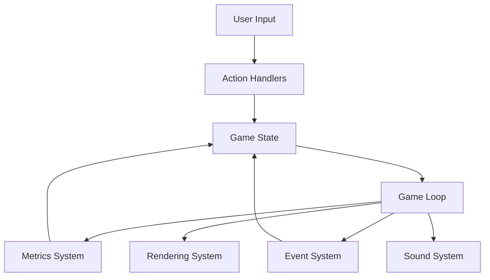
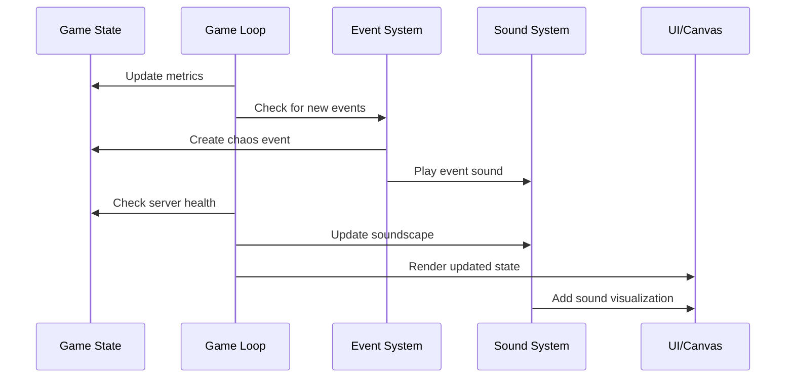
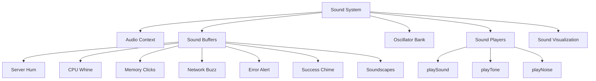

# Server Survival

A tower-defense-style game where you defend your servers from chaos events like CPU spikes and network outages. Perfect for learning SRE skills like monitoring, automation, and resource management.

## Features

✅ **Chaos Events**: Randomly generated issues like high CPU or zombie processes  
✅ **Monitoring**: Real-time metrics for CPU, memory, and errors  
✅ **Automation**: Enable auto-healing to fix issues automatically  
✅ **Scaling**: Add resources to handle increased load  
✅ **Algorithmic Sound Synthesis**: Unique procedurally-generated sounds for every game event  

## How to Play

1. Monitor server metrics (CPU, memory, network)
2. Fix issues manually or enable auto-healing
3. Scale resources to handle higher loads
4. Survive as long as possible without crashing!

## Architecture

The Server Survival game is built with a modular architecture that enables rich interactions between different systems. Here's how everything fits together:

### Core Components

#### Game State
The central store for all game data including:
- Server metrics (CPU, memory, network, error rate)
- Resources and score
- Active chaos events
- Game settings (auto-healing, auto-scaling)
- Sound state and soundscapes

#### Game Loop
Runs at 10 frames per second (100ms interval) to:
- Update metrics based on events
- Check for server health
- Apply automatic healing/scaling if enabled
- Update the UI and canvas visualization
- Manage soundscapes based on server health

#### Event System
- Generates random chaos events based on current wave difficulty
- Each event has specific effects on server metrics
- Events have visual representations on the canvas
- Each event type has a unique sound signature

#### Sound System
A sophisticated procedural audio engine that:
- Uses Web Audio API for real-time sound synthesis
- Generates all sounds algorithmically (no pre-recorded samples)
- Creates dynamic soundscapes that evolve with server health
- Provides audio feedback for all player actions and game events
- Visualizes active sounds on the game canvas

### Data Flow

### Sound Architecture

The sound system uses algorithmic synthesis to create unique, procedurally-generated sounds:

Each sound is generated mathematically using techniques like:
- Additive synthesis (combining sine waves)
- Frequency modulation
- Amplitude modulation
- Noise filtering
- Digital artifacts and glitches

The soundscapes change dynamically based on server health:
- **Calm Server**: Peaceful ambient hum with occasional status beeps
- **Busy Server**: More active processing sounds with faster fan noise
- **Critical Server**: Alarming tones with system warnings and glitches

## Setup Instructions

1. Clone the repository
2. Open `index.html` in your browser
3. Start defending your servers!

## Technologies Used

- HTML5 Canvas for rendering
- Web Audio API for procedural sound synthesis
- JavaScript for game logic
- CSS for styling

## Future Enhancements

- Multiplayer mode for collaborative server defense
- Integration with real Prometheus metrics
- More complex chaos events and mitigation strategies
- Additional advanced sound synthesis techniques

## License

MIT License 